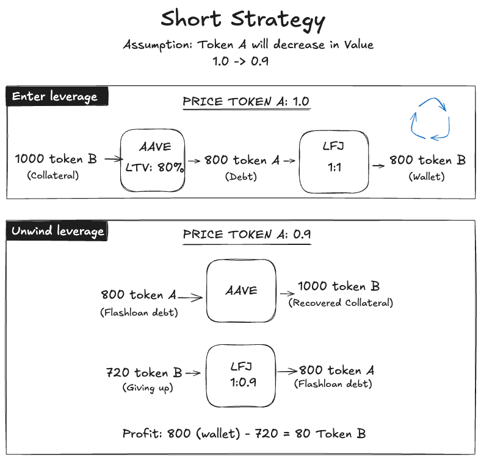
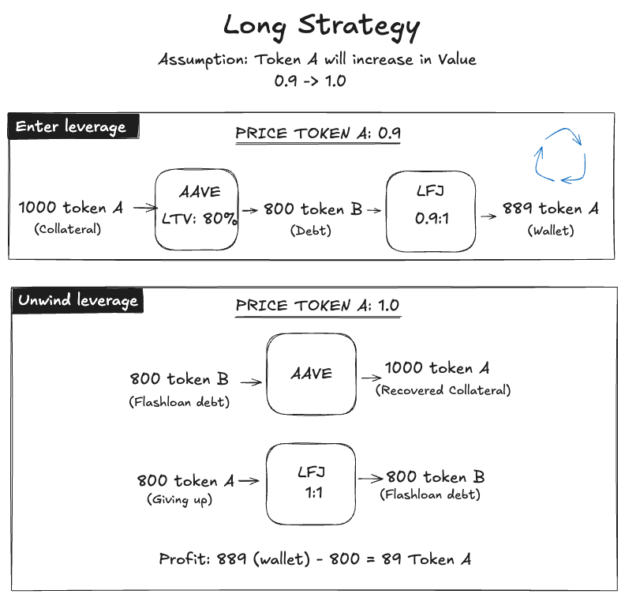
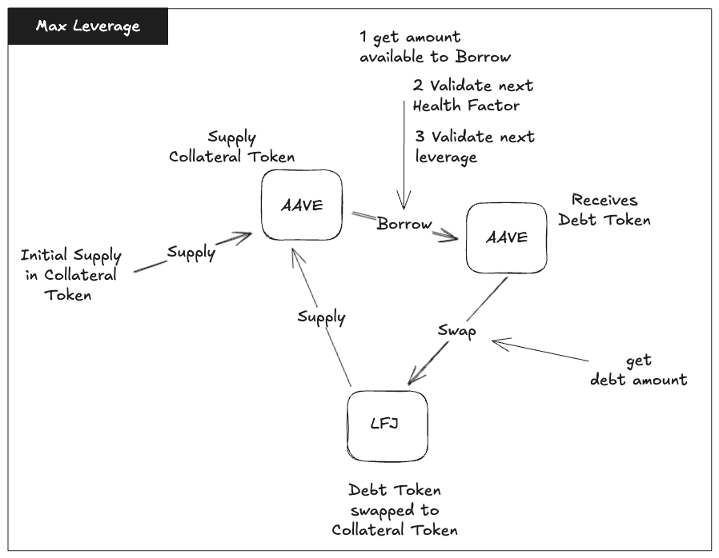

# Depeg Strategy

## Clone and Run Tests
```bash
git clone https://github.com/leemarreros/DepegStrategy.git
cd DepegStrategy
forge install
forge test -vv
```

## Overview

This is a trading strategy for taking advantage of the depeg between two stable coins. While the amount of tokens could remain the same, the underlying value may be different. For instance, at a certain point 10 USDC are worth 10 USD, while at another moment, they are worth 9.8 USD. The same would apply to any other stable coin. This gap is also reflected in the trading pool when two stable coins are exchanged. Sometimes 10 USDC are worth 11 USDT, while at another moment, they are worth 9 USDT. To take advantage of strategy, a gap in their underlying value must be detected and at the same time there must exist a favorable exchange rate within the trading pool.

In order to amplify the leverage, we will be depositing a collateral into Aave to borrow a token. Then, the borrowed token will be swaped by the collateral token through LFJ (ex Trader Joe) to then put it as more collateral into the Aave pool. That will give us more borrowed tokens and the cycle repets until the max leverage is reached. This could potentially convert an initial 1000 tokens into 14000 token with maximum leverage (MAX_LEVERAGE = 1 / (1 - LTV) = 1 / (1 - 93%) = 14x).

There are two strategies to follow: short and long. In both of them there are two types of tokens: the collateral token and the debt token. 

_Note: the implementation of this algorithm is agnostic. Hence, it will work with any pair of tokens, even for non-stable ones._

## Short Strategy

In the short strategy, you expect the debt token to decrease its price. You will sell the debt token at a higher price and buy them back at a lower price.

This position is entered with 1000 collateral tokens. The goal is to accumulate the debt token as much as possible. See in the **Enter leverage** below how providing 1000 collateral tokens to Aave give us 800 debt tokens thank to the Loan To Value (LTV) of 80%. Assumming 1 to 1 exchange rate in LFJ, 800 debt token will be swapped by 800 collateral token (this could be put back in Aave pool). 

In the future, the debt token will decrease its price from 1.0 to 0.9. This is the time to unwind our position. By using a flash loan, we will be able to repay our debt of 800 debt tokens. This will give us back 1000 collateral tokens. In order to pay the flash loan, we will swap our collateral token for the debt token. Now the debt token is worth 0.9. We only need 720 collateral tokens to get 800 debt tokens through LFJ. There is a profit of 80 collateral tokens.



## Long Strategy

In the long strategy, you expect the collateral token to increase its price. You will buy the collateral token at a lower price and sell them back later at a higher one. 

This position is entered with 1000 collateral tokens. The goal is to accumulate the collateral token as much as possible. See in the **Enter leverage** below how providing 1000 collateral tokens to Aave give us 800 debt tokens thank to the Loan To Value (LTV) of 80%. Assumming 0.9 to 1 exchange rate in LFJ, 800 debt token will be swapped by 889 collateral token (this could be put back in Aave pool). 

In the future, the collateral token will increase its price from 0.9 to 1.0. This is the time to unwind our position. By using a flash loan, we will be able to repay our debt of 800 debt tokens. This will give us back 1000 collateral tokens. In order to pay the flash loan, we will swap our collateral token for the debt token. Now the collateral token is worth 1.0. We only need 800 collateral tokens to get 800 debt tokens through LFJ. There is a profit of 89 collateral tokens.



## Max Leverage

In order to leverage as much as possible our initial deposit in Aave, there are some considerations to take into account. 

1. In Aave, when using the emode for stable coins, the LTV is 93%. Through a mathematical formula we can calculate the max leverage that is 1/(1 - 93%) ~ 14x. While it is possible to max out our initial 1000 collateral tokens to 14000 tokens, it will put our health factor in a very dangerous position.

2. The Health Factor (HF) in Aave determines whether our positions gets liquidated or not. If our HF is lower than 1, we will be liquidated. The higher our leverage, the lower our HF will be. So it is not possible to only max out our leverage but also keep our HF above 1, like 1.05, in order to make a profit.

In the image below you can see how the intial supply of collateral tokens enters a cycle to create more leverage. However, before borrowing more debt tokens, important checks are validated. Those checks are the target leverage ratio, provided by the user, and the health factor, calculated at each iteration. Whenever any of those two conditions is not met, the cycle stops and we finalize our entering position.



## Running the tests

There are two testing scenarios. One for short and one for long. Necessary mocks have been implemented.

In the short strategy we want our debt to decrease:
```bash
SHORT strategy:       debt token (USDT): 1.0 -> 0.9
                collateral token (USDC): 1.0 -> 1.0
```

In the long strategy we want our collateral to increase:

```bash
LONG strategy: collateral token (USDC): 0.9 -> 1.0
                     debt token (USDT): 1.0 -> 1.0
```
Run the tests with the following command:
```bash
forge test -vv
```

Expected result:
```bash
[⠊] Compiling...
No files changed, compilation skipped

Ran 2 tests for test/DepegStrategy.t.sol:DepegStrategyTest
[PASS] testLongStrategy() (gas: 6131234)
[PASS] testShortStrategy() (gas: 6131243)
Suite result: ok. 2 passed; 0 failed; 0 skipped; finished in 4.61ms (2.38ms CPU time)
```
